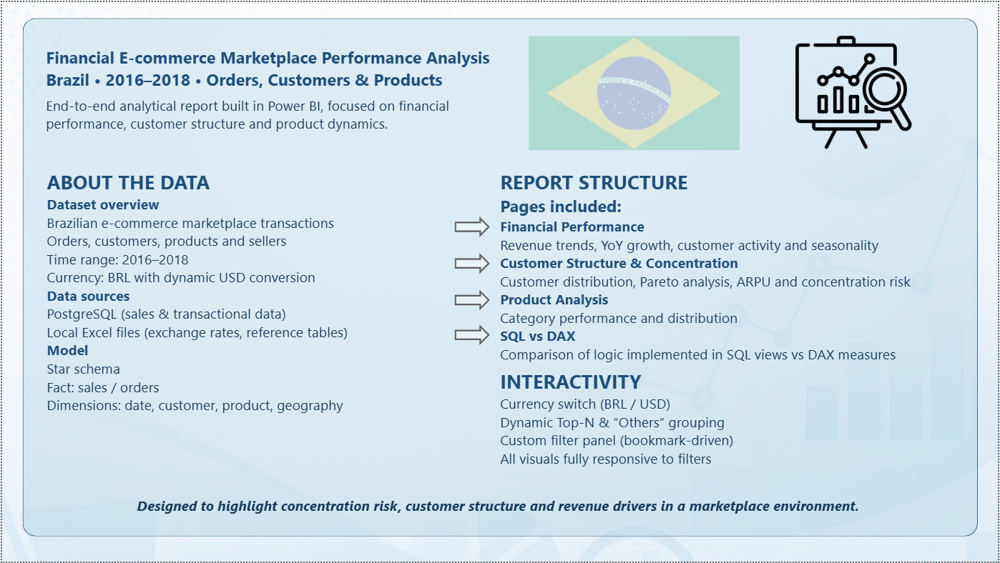
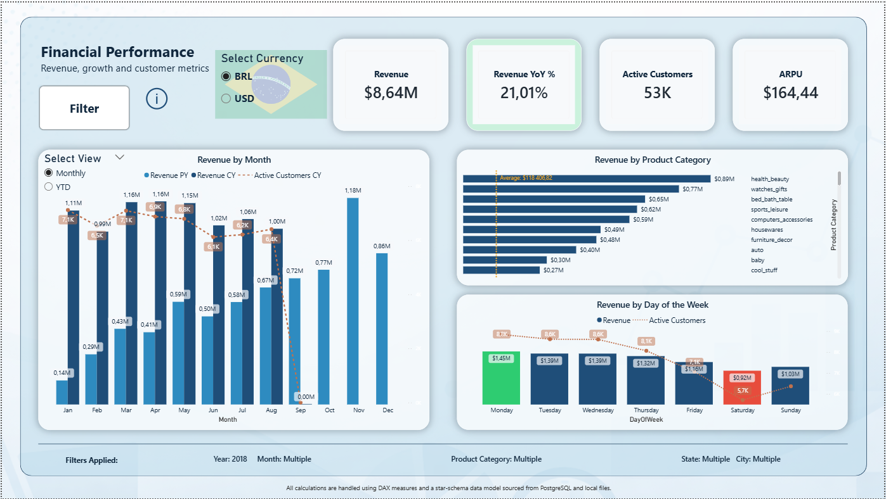
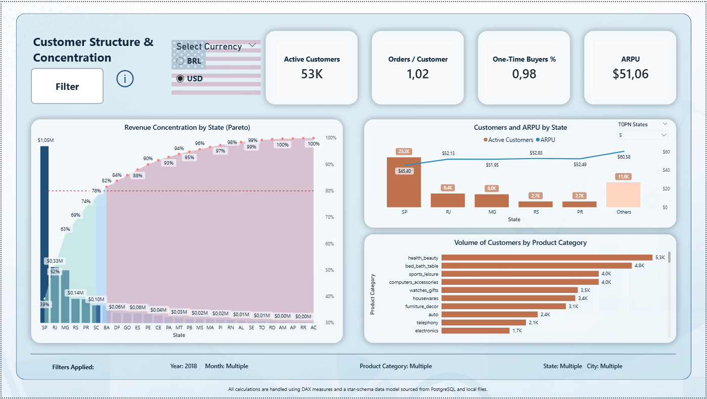
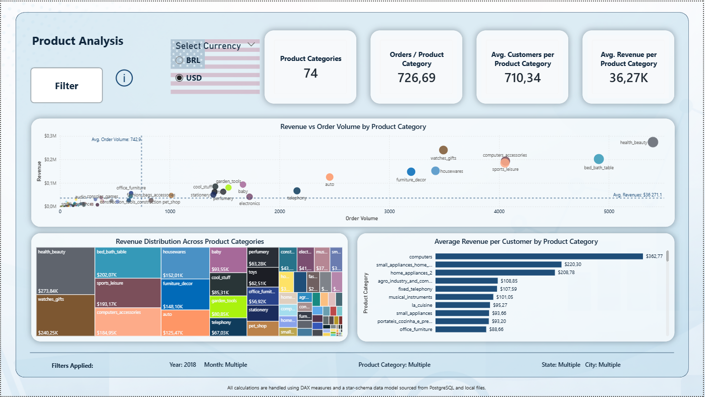
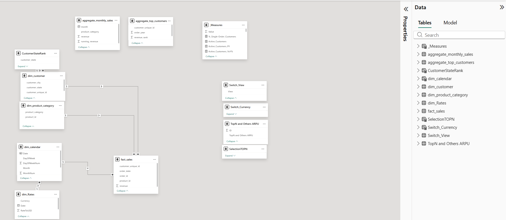

# Financial E-commerce Marketplace Analysis (SQL + Power BI)

End-to-end business intelligence project combining SQL data transformation and Power BI analytics.

Designed as a portfolio-ready BI solution demonstrating a full analytics workflow — from data preparation to interactive dashboarding.

The project focuses on financial performance, customer structure, and product category dynamics in a Brazilian e-commerce marketplace.

---


## Business Problem

E-commerce marketplaces generate large volumes of transactional data, but extracting actionable insights about revenue drivers, customer distribution, and product performance can be challenging.

The key business questions addressed in this project:

• Which regions generate the majority of revenue?  
• How concentrated is revenue across customers and locations?  
• Which product categories drive the highest value vs volume?  
• Are there high-demand but low-value segments?  

The goal is to transform raw transactional data into clear, decision-support insights.

---
## Project Overview

This project combines SQL-based data preparation with Power BI data modeling and visualization.

Data was pre-aggregated and transformed using SQL (PostgreSQL), then modeled and analyzed in Power BI using DAX measures and interactive visuals.

The dashboard focuses on:

• Financial performance and revenue trends  
• Customer structure and revenue concentration  
• Product category performance and demand patterns  

---

## Dashboard Preview





---

## 🧠 SQL Data Preparation

The data transformation layer was implemented using SQL views to create a structured and analysis-ready dataset before loading into Power BI.

Instead of performing all transformations in Power BI, a dedicated SQL layer was introduced to:

• simplify the data model  
• improve performance  
• separate transformation logic from reporting  
• ensure data consistency across analytical use cases  

### Key SQL transformations

The solution is based on multiple SQL views:

• `v_sales` – base fact view combining orders, customers, and revenue  
• `v_customer` – cleaned customer dimension with deduplicated location data  
• `dim_product_category` – standardized product categories (translated to English)  

---

### Example: Fact View (v_sales)

```sql
CREATE VIEW v_sales AS
SELECT
    o.order_id,
    o.order_purchase_timestamp::date AS order_date,
    c.customer_unique_id,
    oi.product_id,
    oi.price + oi.freight_value AS revenue
FROM olist_orders_dataset o
JOIN olist_order_items_dataset oi
    ON o.order_id = oi.order_id
JOIN olist_customers_dataset c
    ON o.customer_id = c.customer_id;
```

---

## Dataset

The dataset represents a Brazilian e-commerce marketplace (Olist-style transactional dataset) and includes:

• Orders and transaction data  
• Customer information and geographic location  
• Product categories  
• Revenue metrics  

Time range: **2016–2018**  
Currency: **BRL with dynamic USD conversion**

The dataset structure follows a **star schema data model** optimized for analytical queries.

---

## Data Model

The report uses a star schema model with SQL-based pre-aggregations.

Fact table:

• fact_sales – transactional order data  

Dimensions:

• dim_calendar  
• dim_customer  
• dim_product_category  
• dim_rates (currency conversion)

Additional helper tables were implemented for dynamic report features (Top-N, currency switch, filters).



---

## Technical Highlights

• Dynamic currency switch (BRL / USD)  
• Top-N analysis with automatic "Others" grouping  
• Pareto analysis for revenue concentration  
• Interactive filter panel (time, geography, product)  
• KPI overview for financial and operational metrics  
• Cross-filtering across all visuals  
• Separation of SQL and DAX logic for performance and scalability  

---

## Dashboard Pages

### Financial Performance
Analysis of revenue trends, growth dynamics, and overall marketplace performance.

Key insights:
• Revenue trends over time  
• Year-over-year growth  
• Revenue distribution across product categories  

---

### Customer Structure & Concentration
Analysis of customer distribution and revenue concentration across regions.

Key insights:
• Pareto analysis of revenue by state  
• Customer distribution across key regions  
• ARPU comparison across top states  

---

### Product Analysis
Evaluation of product category performance and demand patterns.

Key insights:
• Revenue vs order volume by category  
• Product category revenue distribution  
• Average revenue per customer by category  

---

### SQL vs DAX (Work in Progress)


---


## Key Insights

• Revenue is highly concentrated – a small number of states generate the majority of total revenue (Pareto effect)  
• The top-performing state significantly outperforms others in both customer volume and total revenue  
• Some product categories generate high order volume but relatively lower revenue, indicating lower-value transactions  
• High-revenue categories are not always the ones with the highest demand, highlighting premium vs mass segments  
• Customer behavior is largely transactional, with most users placing only a single order

---

## Technical Stack

Power BI  
DAX  
SQL (PostgreSQL)  
Data Modeling (Star Schema)  
Power Query  
Interactive dashboard design  
